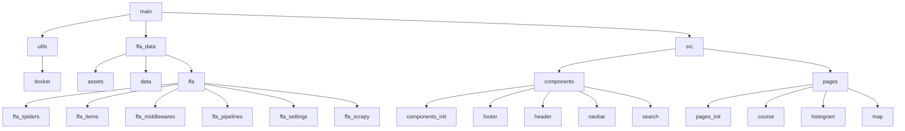
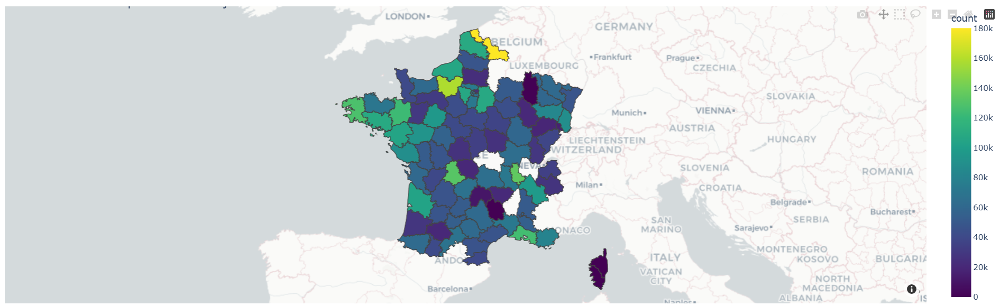

# Projet FFA - Dashboard Fédération Française Athlétisme

#
# USER GUIDE

Avant de lire la suite du texte, assurer-vous d'avoir installer mongoDB, Docker et ElasticSearch. Pour déployer le dashboard après avoir récupérer le projet depuis un repertoire distant, il faut ouvrir le dossier dans une application permettant d'éxcuter du code python comme VS code par exemple. Ou alors ouvrir DockerDeckstop et se mettre sur le chemin du dossier dans le terminal. Une fois que vous avez réalis l'un ou l'autre, il suffit de run la commande docker-compose up --build pour lancer le fichier docker-compose du dossier qui va lancer tout le projet. Il n'y a pas besoin de réaliser une quelconque manipulation auparavant car tout est programmé dans le fichier docker-compose, ce dernier run une commande pour installer les packages présent dans le fichier requirements.txt.  Lors du premier build, vous devrez attendre un moment pour que le fichier s'execute,à la fin de l'éxécution de ce dernier, un serveur accessible, via une adresse IP qui sera fournit dans le terminal, va se lancer. Attention, il faut utiliser le lien : http://localhost:8060/ sur uen page web pour être redirigé vers le dashboard. Il est organisé avec un système de pages, lorsque l'utilisateur lance le dashboard, il arrive sur une page où il pourra choisir quel graphique il veut consulter grâce à une navbar. L'utilisateur pourra facilement naviguer entre les différents graphiques d'un simple appui. De plus, ce dernier rencontrera des listes déroulantes interactives pour changer le visuel de certains graphiques.

#
# DATA

Nous avons choisis de scrapper le site de la FFA pour ce projet voici l'url : "https://bases.athle.fr/asp.net/liste.aspx?frmpostback=true&frmbase=calendrier&frmmode=1&frmespace=0"

Néanmoins, pour scrapper nos données nous avons utilisé cet url comme une base avant de faire une concaténation d'url avec les saisons, types et niveaux sur le site de la FFA.

#
# DEVELOPER GUIDE

## Structure du projet

## Architecture du code

## Introduction

Ce projet est une application web interactive construite avec Dash pour la visualisation et l'analyse des performances de coureurs et des compétitions de marathon. L'application utilise Elasticsearch pour gérer et rechercher des données de compétitions et de coureurs, et MongoDB pour stocker les résultats de course.

L'objectif de l'application est d'offrir une interface simple permettant à l'utilisateur de rechercher des coureurs et des compétitions, de visualiser des cartes géographiques et des graphiques statistiques.

## Description des Fichiers

### main.py

Description : Fichier principal de l'application Dash. Il initialise le serveur Dash et enregistre les pages disponibles. Le layout principal utilise dcc.Location et dash.page_container pour rendre dynamiquement les pages.
Responsabilité : Démarrer l'application Dash et gérer le routage des pages.

### docker-compose.yaml

Description : Fichier de configuration Docker qui définit les services nécessaires à l'application. Il configure MongoDB, Elasticsearch, et l'application elle-même (conteneur app-service).
Responsabilité : Orchestrer les différents services nécessaires au fonctionnement de l'application, y compris la base de données et le serveur web.

### Dockerfile
Description : Ce fichier définit l'environnement de conteneur pour l'application, installant les dépendances et copiant les fichiers nécessaires à l'application.
Responsabilité : Créer un conteneur Docker qui exécutera l'application Dash avec toutes ses dépendances.

### Mongo_Elastic.py
Description : Ce fichier synchronise les données entre MongoDB et Elasticsearch. Il récupère les données de MongoDB, les transforme et les insère dans Elasticsearch.
Responsabilité : Synchroniser les données entre MongoDB et Elasticsearch, gérer l'indexation des documents dans Elasticsearch.

## SRC

### Utils

Les fichiers ici contiennent des fonctions utilitaires pour l'interaction avec les bases de données et la gestion des données.

**get_data.py**

Description : Contient la fonction extract_Http(url) qui télécharge et extrait un fichier ZIP contenant des données CSV. Ces données sont ensuite sauvegardées dans le dossier data/rawdata.
Responsabilité : Télécharger et extraire des fichiers CSV à partir d'une URL fournie.

**get_Json.py**

Description : Contient la fonction extract_GeoJson(url) qui télécharge et charge un fichier GeoJSON à partir d'une URL.
Responsabilité : Télécharger et charger des fichiers GeoJSON pour l'application.

**Utils.py**

Description : Ce fichier contient plusieurs fonctions utilitaires essentielles pour l'application, y compris la gestion des données géographiques et des recherches dans Elasticsearch.
Responsabilité : Gérer les opérations comme le chargement des données géographiques, la recherche dans Elasticsearch, et la génération des cartes.

### Components
Les composants du dashboard se trouvent dans ce dossier. Ils comprennent la barre de navigation, l'en-tête et le pied de page.

**navbar.py**

Description : Définit la barre de navigation du site, permettant à l'utilisateur de naviguer entre les différentes pages.
Responsabilité : Gérer les liens de navigation et l'apparence de la barre de navigation.

**header.py**

Description : Contient le titre principal du site.
Responsabilité : Afficher un titre centré en haut de la page.

**footer.py**

Description : Contient le pied de page avec des informations sur les auteurs et le projet.
Responsabilité : Fournir un pied de page avec des informations sur l'équipe de développement et l'année de création.

### Pages

Les pages du dashboard sont définies ici.

**Coureur.py**

Description : Permet à l'utilisateur de rechercher des coureurs en fonction de différents critères (prénom, nom, club, etc.). Les résultats sont récupérés de Elasticsearch et affichés sous forme de tableau.
Responsabilité : Gérer la recherche des coureurs et afficher les résultats dynamiquement.

**Course.py**

Description : Permet de rechercher des compétitions selon des critères (nom, niveau, département). Les résultats sont affichés sous forme de tableau.
Responsabilité : Gérer la recherche des compétitions et afficher les résultats.

**Map.py**

Description : Affiche une carte des départements français avec des informations sur les coureurs et les compétitions. Utilise la fonction generate_map() pour générer la carte.
Responsabilité : Gérer l'affichage des cartes interactives.

**Histogram.py**

Description : Affiche des histogrammes qui analysent les performances des coureurs en fonction des distances parcourues et des temps de course. Utilise Plotly pour afficher des graphiques dynamiques.
Responsabilité : Gérer l'affichage des histogrammes pour l'analyse des performances.

## Fonctionnalités et Interactions

### Interactivité
L'application utilise des éléments interactifs comme :

dcc.Input et dcc.Dropdown pour les recherches et les filtres dynamiques.
dcc.Graph pour afficher des graphiques et des cartes générées par Plotly.

### Callbacks
Les callbacks sont utilisés pour rendre l'application interactive. Par exemple :

Les résultats de recherche sont mis à jour en fonction des critères de l'utilisateur.
Les graphiques et cartes sont mis à jour dynamiquement en fonction des sélections de l'utilisateur.

### Gestion des données
Les données sont récupérées depuis Elasticsearch et MongoDB, et utilisées pour générer des cartes et des graphiques. Les données de MongoDB sont synchronisées avec Elasticsearch pour permettre une recherche rapide et efficace.

#
# Rapport d'analyse

Dans cette section nous allons vous partager différentes informations sur les pages du dashboard.

## Page Coureur

Cette première page vous permet de chercher les résultats d'un coureur à l'aide de ce nom et/ou prenom. Vous pouvez aussi chercher les résultats des coureurs d'un club. De plus, pour ces coureurs, vous pouvez suivre leur résultats sur des plages de distances ou de dates pour une recherche approfondi. Néanmoins voici une petite indication pour utiliser la recherche correctement, lors d'une recherche par date, il est obligatoire d'indiquer une année si un mois est renseigné, de même il est obligatoire d'indiquer un mois si un jour est renseigné.

## Page Course

Cette seconde page permet d'étudier cette fois les courses et non pas les coureurs. L'utilisateur peut chercher selon un système de date qui est le même que sur la page précèdente. La recherche peut aussi être précisé selon le nom de la course, le niveau de cette dernière ou bien encore le département où elle a lieu.
 
## Page Map

Cette page permet d'avoir une vision d'ensemble de la répartition des coureurs en France selon les départements. On peut ainsi y voir quels sont les départements compétitifs en France pour la course. Les zones non rensignées par une couleur indiquent une absence de donnée pour les évaluer. 

## Page Histogramme

Cette page permet d'observer la distribution des résultats pour la course choisie, ainsi les athlètes peuvent se situer en terme de résultats. On peut bien évidemment choisir la distance de chaque course lors de la recherche.

## Exemple d'utilisation du dashboard

Le but de ce dashboard est de pouvoir trouver ses résultats sur la première page en tant que coureur. Ensuite on peut rechercher la course en question pour l'étudier (nombre de coureur etc). Enfin, grâce à la page histogramme, on peut examiner la distribution des résultats pour se situer dans le niveau de la course. Ainsi chaque coureur peut effectuer une analyse approfondi de ses rsultats sur chaque course qu'il a effectué. 

