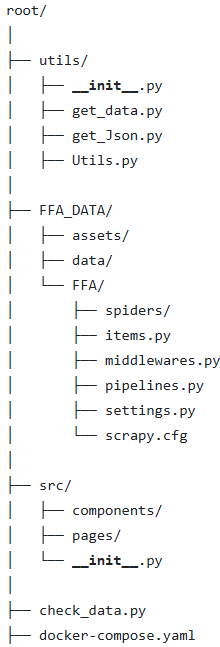
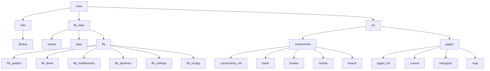

# Projet FFA - Dashboard Marathon


#Commande pour copier le csv du docker
#docker cp 86cbaa15d83e:/app/TestDocker_results.csv C:\Users\Rémi\OneDrive\Bureau\Esiee\Esiee\E4\DSIA\Projet_FFA\Projet_Scrap\Test1234.csv
#
# USER GUIDE

Avant de lire la suite du texte, assurer-vous d'avoir installer mongoDB, Docker et ElasticSearch. Pour déployer le dashboard après avoir récupérer le projet depuis un repertoire distant, il faut ouvrir le dossier dans une application permettant d'éxcuter du code python comme VS code par exemple. Ou alors ouvrir DockerDeckstop et se mettre sur le chemin du dossier dans le terminal. Une fois que vous avez réalis l'un ou l'autre, il suffit de run la commande docker-compose up --build pour lancer le fichier docker-compose du dossier qui va lancer tout le projet. Il n'y a pas besoin de réaliser une quelconque manipulation auparavant car tout est programmé dans le fichier docker-compose, ce dernier run une commande pour installer les packages présent dans le fichier requirements.txt.  Lors du premier build, vous devrez attendre un moment pour que le fichier s'execute,à la fin de l'éxécution de ce dernier, un serveur accessible, via une adresse IP qui sera fournit dans le terminal, va se lancer. Attention, il faut utiliser le lien : http://localhost:8060/ sur uen page web pour être redirigé vers le dashboard. Il est organisé avec un système de pages, lorsque l'utilisateur lance le dashboard, il arrive sur une page où il pourra choisir quel graphique il veut consulter grâce à une navbar. L'utilisateur pourra facilement naviguer entre les différents graphiques d'un simple appui. De plus, ce dernier rencontrera des listes déroulantes interactives pour changer le visuel de certains graphiques.

#
# DATA


Nous avons choisis de scrapper le site de la FFA pour ce projet voici l'url : "https://bases.athle.fr/asp.net/liste.aspx?frmpostback=true&frmbase=calendrier&frmmode=1&frmespace=0"

#
# DEVELOPER GUIDE

## Structure du projet



## Architecture du code


## Main : 

**main.py :**

- Initialise l'application Dash en définissant les paramètres nécessaires pour les pages.

- Défini le layout principal de l'application avec une structure de navigation basée sur dcc.Location et dash.page_container.

- Exécute l'application avec app.run_server(debug=True) pour démarrer le serveur et afficher le dashboard.

## SRC :

### _Components_ (tous les composants du dashboard)

Les composants sont situés dans le dossier components, chaque fichier gérant une partie distincte du dashboard. Voici une description de chacun des fichiers et de leur fonction.

**init.py**

Ce fichier initialise l'import des composants dans le module. Il permet d'importer les composants facilement en utilisant "_from components import ComponentName_".

**navbar.py**

Définit la barre de navigation en utilisant html.Nav et dcc.Link de Dash. Chaque lien représente une page distincte, telle que "Home", "Histogram Boston 2019", etc. Les options de style permettent une interface personelle et une uniformité dans l'apparence de la navigation.

**header.py**

Contient le titre principal de l'application, affiché en haut de la page avec des styles pour le centrer et lui donner un fond noir. 

**footer.py**

Gère le pied de page avec un texte indiquant les auteurs et l'année.

**dropdowndecade.py**

Crée un menu déroulant pour la sélection des décennies à partir d'une liste de valeurs. Ce composant est essentiel pour choisir l'année des enregistrements à afficher sur les cartes.

**dropdownhistogramme.py**

Fournit un menu déroulant permettant de choisir différents types d'histogrammes (général, hommes, femmes, comparatif). Ce composant permet d'adapter le graphique selon le genre ou de le comparer.


### _Pages_ (les pages du dashboard)

**home.py** 

- Affiche la page d'accueil.

- Utilise l'en-tête (Header) et la barre de navigation (Navbar) en haut de la page.

- Centre une image au milieu de la page, avec un style aligné et une taille réduite.

- Affiche le pied de page (Footer) en bas.

**map.py**


- Affiche une carte des meilleurs pays pour les marathons.

- Récupère les données CSV depuis une URL, ainsi que des données géographiques en format GeoJSON.

- Génère une carte interactive en classant les pays par nombre de records de marathon.

- Intègre un IFrame pour afficher la carte générée dans la page.

- Affiche des explications sur les différences de records entre les pays pour contextualiser les données.

- Utilise l'en-tête (Header), la barre de navigation (Navbar), et le pied de page (Footer) pour une structure complète de la page.

**evolution.py**


- Montre l'évolution des records de marathon par pays à travers plusieurs décennies.

- Récupère les données CSV et GeoJSON depuis des URL pour la visualisation géographique.

- Crée des cartes pour chaque décennie, en utilisant des classes spécifiques pour afficher les différences de records.

- Utilise un dropdown (DropdownDecade) pour sélectionner et afficher des cartes par décennie.

- Affiche une carte d’évolution globale des records dans une autre IFrame.

- Fournit des explications sur les tendances d’évolution des performances par pays et par époque.

- Intègre l'en-tête (Header), la barre de navigation (Navbar), et le pied de page (Footer).

**graph.py**


- Affiche un graphique illustrant l’évolution du nombre de records de marathon sur plusieurs années.

- Récupère les données CSV d’une URL, puis les utilise pour générer un graphique.

- Affiche un graphique interactif avec le nombre de records dans le top 4000, pour chaque année.

- Fournit des explications sur l’augmentation des records au fil des années et sur les progrès des athlètes.

- Utilise l'en-tête (Header), la barre de navigation (Navbar), et le pied de page (Footer) pour structurer la page.

**histogram.py** 

- Affiche un histogramme basé sur les performances de marathon du Boston Marathon.

- Récupère les données CSV depuis une URL pour les performances.

- Génère plusieurs histogrammes (global, hommes, femmes) montrant la répartition des temps de course.

- Inclut un dropdown (DropdownHistogramme) pour que l'utilisateur sélectionne le type d'histogramme à afficher.

- Affiche des explications sur les différences de performances entre les genres et la distribution des temps de course.

- Utilise l'en-tête (Header), la barre de navigation (Navbar), et le pied de page (Footer) pour structurer la page.


### _Utils_ (les fonctions qu’on va utiliser pour jouer avec nos données)

**__init__.py**

Fichier vide permettant de reconnaître le dossier comme un package Python.

**get_data.py**

Fonction _**extract_Http**(url) _:


- Définit une requête HTTP avec un agent utilisateur spécifique pour accéder aux fichiers.

- Crée un répertoire de sortie pour enregistrer les données téléchargées.

- Télécharge un fichier ZIP depuis une URL et en extrait le premier fichier CSV dans le répertoire de sortie.

- Affiche un message de confirmation ou une erreur si le téléchargement ou l'extraction échoue.

**get_Json.py**

Fonction _**extract_GeoJson**(url)_ :


- Télécharge un fichier GeoJSON depuis une URL et le charge en format JSON.

- Renvoie le contenu JSON ou affiche une erreur en cas d'échec.

**utils.py**

Fonction _**print_histogramme**(Mt, bins, col, titre)_ :


- Convertit une colonne de données de temps en heures pour générer un histogramme.

- Affiche et sauvegarde l'histogramme avec les étiquettes de temps et de nombre de coureurs.

Fonction _**print_gender_histogramme**(Mt, bins, col, titre, gender)_:

- Crée deux histogrammes superposés pour les coureurs masculins et féminins.

- Personnalise les couleurs et labels pour chaque genre.

- Génère un graphique interactif Plotly montrant les différences entre genres.

Fonction _**print_one_gender_histogramme**(Mt, bins, col, titre, gender, color, label)_ :


- Affiche un histogramme pour un genre spécifique avec des couleurs personnalisées.

- Ajoute les étiquettes et les titres adaptés pour mieux visualiser les données d'un seul genre.

Fonction _**Meilleur_Temps**(Genre, Mt)_ :

- Calcule et affiche le meilleur temps enregistré pour le genre spécifié.

Fonction _**Pire_Temps**(Genre, Mt)_ :


- Calcule et affiche le pire temps enregistré pour le genre spécifié.

Fonction _**convertir_temps_en_secondes**(temps_str)_ :

- Convertit un temps au format "hh:mm:ss" en secondes.

Fonction _**print_map**(Mt, geo_data, coords, legend, bins, Map_Name, years=[0, 0])_ :

- Filtre les données par années si nécessaire.

- Crée une carte choroplèthe interactive de la fréquence des records par pays, ajoutant des infobulles pour chaque pays.

- Sauvegarde la carte générée dans un dossier dédié.

Fonction _**print_graph**(Mt)_ :

- Prépare un graphique montrant l'évolution annuelle du nombre de records.

- Sauvegarde le graphique sous forme d'image.

Fonction _**map_evolve**(Mt, geo_data, coords, legend, Map_Name, bins)_ :

- Génère une carte de l'évolution des performances par pays en comparant deux périodes de données.

- Calcule la variation entre les deux périodes et l’affiche sous forme de carte choroplèthe interactive.

Fonction _**convert_to_hours**(time_str)_ :


- Convertit un temps au format "hh:mm:ss" en heures.
Fonction coureur(Mt, name) :


- Recherche un coureur spécifique par nom dans les données.

Fonction _**Graph**(Mt)_ :

- Affiche une ligne de tendance pour la répartition annuelle des records sur plusieurs années.

- Crée un graphique interactif Plotly avec les données chronologiques.

Fonction _**hist**(Mt)_ :


- Affiche un histogramme de la distribution des temps de course pour le marathon de Boston 2019.

- Utilise Plotly pour afficher un histogramme avec les étiquettes ajustées pour le temps et le nombre de coureurs.

### Ajouter une page ou un graphique au Dashboard

Le système de pages de Dash permet d'ajouter facilement de nouvelles pages ou graphiques à votre application. Voici un guide étape par étape pour le faire, en tenant compte de la structure du fichier main.py.

**1. Ajouter une nouvelle page**

Le framework Dash facilite l'ajout de nouvelles pages via le système de pages dynamiques. Voici les étapes :

- Créer un fichier de page dans le dossier src/pages :

Chaque page de l'application est un fichier Python dans le dossier src/pages. Vous pouvez créer une nouvelle page en ajoutant un fichier Python avec une logique spécifique.

- Définir la mise en page de la page : Dans ce fichier, vous pouvez utiliser html.Div et les composants Dash (comme dcc.Graph, dcc.Dropdown, etc.) pour définir la mise en page et les graphiques spécifiques à cette page.

- Navigation vers la nouvelle page : La page sera automatiquement détectée et accessible via l'URL définie pour cette page, grâce à l'utilisation du composant dash.page_container dans le fichier main.py.

**2. Ajouter un graphique à une page**

Si vous souhaitez ajouter un graphique (ou un autre composant interactif) à une page existante, voici les étapes :

- Importer les bibliothèques nécessaires : Assurez-vous d'importer toutes les bibliothèques nécessaires pour le graphique. Par exemple, si vous souhaitez afficher un graphique Plotly, vous devez importer les bibliothèques appropriées.

- Définir le graphique dans le layout de la page : Vous pouvez intégrer un graphique dans la mise en page de votre page en utilisant dcc.Graph.

- Ajouter le graphique au fichier de page : Une fois le graphique défini, vous pouvez l'inclure dans la mise en page de votre page, et il sera automatiquement affiché lorsque vous naviguerez vers cette page.

3. **Modifier la barre de navigation pour inclure la nouvelle page**

- Si vous avez une barre de navigation qui permet de changer de page, vous devrez mettre à jour la barre de navigation dans votre fichier de composants (par exemple src/components/navbar.py) pour inclure un lien vers la nouvelle page.

#
# Rapport d'analyse

Les sets que nous avons utilisés nous ont permis de conclure sur différentes problématiques. 

Tout d'abord, le premier graphique apparaissant sur le dashboard, l'histrogramme de Boston, nous permet d'étudier le rythme de course d'un marathon spécifiquement. Nous pouvons observer quel est le temps le plus réalisés ou du moins la tranche de temps où les coureurs se situent le plus. Cette observation peut nous indiquer quelles seront les besoin de personnes à l'arrivée en fonction du temps de la course. Cette démarche permettra de prendre en charge les coureurs qui ont fini le marathon plus efficacement et de mieux gérer le nombre de personnes présentes pour aider. Bien sûr tous les marathons sont différents donc cette étude est plus efficaces sur le marathon en question, cependant avec ces observations, il est possible d'avoir une idée de l'affluence des coureurs en fonction du temps pour les autres marathons en réalisant une comparaison.
En étudiant le marathon de Boston de 2019, on observe que la période d'arrivé avec le plus d'affluence est entre 3h20 et 3h50 de temps de course pour le graphique général.
 


 
 On peut préciser l'étude en fonction du genre pour comparer les performances, on remarque que la période de temps obtenu pour les hommes est entre 3h et 3h35. 


Tandis que pour les femmes, la période est entre 3h25 et 4h.


On peut aussi afficher le comparatif entre les deux sexes pour mieux visualiser les performances.


Ensuite, le deuxième graphique présent sur le dashboard est l'histogramme représentant la répartition des records en fonction du temps. En fait, on observe ici le nombre de records mis en place par années. Ce graphique nous montre à quel point le marathon devient de plus en plus compétitif. On se rend compte que la plus part des records actuels au marathon sont assez récent, ça veut dire que les coureurs sont de plus en plus fort et battent les records datant des années les plus vieilles. Il nous permet d'étudier cette tendance et donc aussi de pouvoir faire des hypothèses sur la futur importance de cette discipline dans les évènements sportifs. On peut aussi se poser la question sur les facteurs amenant à cette évolution, les principales hypothèses sont des entraînements mieux organisés, un régime alimentaire plus équilibré, et surtout une augmentation du nombre de participants. On peut donc conclure que la marathon est une discipline qui prend de plus en plus d'envergure.


Le premier geographique montre la répartition des 4000 meilleurs coureurs et 4000 meilleures coureuses de marathon dans le monde par pays au jour d'aujourd'hui. Il présente différentes échelles pour avoir une distinction significative entre les pays. Ce graphique nous permet d'observer quels pays sont les plus dominants dans le marathon aujourd'hui, ainsi cette carte peut nous permettre de prédire les résultats des futures compétitions internationales.


Les deux derniers graphique sont des geographiques, le premier nous permet d'observer la répartition dans le monde des athlètes avec les meilleurs temps de course selon les décennies. Le deuxième lui permet de faire une analyse sur l'évolution des résultats pour chaque pays au marathon. Les pays gagnant moins ces dernières années par rapport aux années plus anciennes sont en rouges tandis que ceu qui sont en progression sont en vert. Nous pouvons observer différentes tendances et ainsi voir quels pays dominent et risquent de dominer les prochaines années dans le marathon. Ce graphique nous donne aussi un aperçu de l'histoire des records dans le marathon.


Sur le graphique de gauche, on remarque qu'avant 1990, c'était surtout l'Amérique du Nord et l'Europe qui étaient les plus représentées. Aujourd'hui, ce sont essentiellement des pays d'Afrique qui enregistrent le plus de coureurs avec des records.
Le graphique de droite met en évidence le déclin de l'Europe et de l'Amérique du Nord, au profit de l'Afrique.
Ainsi, ces deux graphiques montrent la montée en puissance des coureurs africains qui dominent le marathon aujourd'hui au détriment des autres continent qui ont de plus en plus de mal à avoir des coureurs performants dans cette discipline.

### Conclusion de l'analyse

Grâce à nos différents graphiques, nous avons étudiés plusieurs sujets importants du marathon. Nous avons pu à partir d'un cas particulier, étudier la différence de performance entre homme et femme mais surtout pu déterminer les périodes avec le plus d'arrivées et donc permettre un meilleur fonctionnement dans l'accueil des coureurs ainsi que dans l'encadrement global de la course (surveillance, aide etc). Nous avons aussi pu déterminer les périodes d'inscription des records au marathon, et conclure que le marathon devenait de plus en plus compétitif car beaucoup des records sont réalisés ces dernières années (les années 2000).
Enfin pour finir notre étude, nous avons réalisés différentes cartes pour étudier les résultats des coureurs selon les pays. Nous en avons conclu que tous les continents beaucoup de pays européens, d'asie et d'océanie sont en déclin tandis que l'Amérique elle peine à se stabiliser dans ses résultats. Les pays qui se dégagent comme ayant progressé ces dernières années sont les pays d'Afrique qui dominent aujourd'hui au marathon.


#
# Copyright

Je déclare sur nous même que le code ci dessous a été réalisé par nous même sauf les parties ci-dessous : 

Nous nous sommes aidés du cours pour la partie dashboard nottament de ce bout de code ci dessous :
```python
#filename = 'dash-01.py

#Imports

import plotly_express as px

import dash
import dash_core_components as dcc
import dash_html_components as html

# Data

year = 2002

gapminder = px.data.gapminder() # (1)
years = gapminder["year"].unique()
data = { year:gapminder.query("year == @year") for year in years} # (2)

# Main

if __name__ == '__main__':

    app = dash.Dash(__name__) # (3)

    fig = px.scatter(data[year], x="gdpPercap", y="lifeExp",
                        color="continent",
                        size="pop",
                        hover_name="country") # (4)


    app.layout = html.Div(children=[

                            html.H1(children=f'Life expectancy vs GDP per capita ({year})',
                                        style={'textAlign': 'center', 'color': '#7FDBFF'}), # (5)

                            dcc.Graph(
                                id='graph1',
                                figure=fig
                            ), # (6)

                            html.Div(children=f'''
                                The graph above shows relationship between life expectancy and
                                GDP per capita for year {year}. Each continent data has its own
                                colour and symbol size is proportionnal to country population.
                                Mouse over for details.
                            '''), # (7)

    ]
    )

    #
    # RUN APP
    #

    app.run_server(debug=True) # (8)
```

Ce code nous a permis d'initialiser le dashboard, de générer les différents graphiques sur ce dernier et enfin de lancer l'application. Bien sûr nous avons réadapté le code à nos graphiques et nous avons aussi segmenté ce code puisque c'était plus simple pour gérer l'architecture des données.

Utilisation du UserGuide pour les composants tel que la navabar, le footer et le header. Notre utilisation s'est limité à observer la stucture à utiliser pour initialiser correctement nos composants du dashboard puis nous l'avons adapter au différent composants utilisés. 
https://dash.plotly.com/dash-html-components
